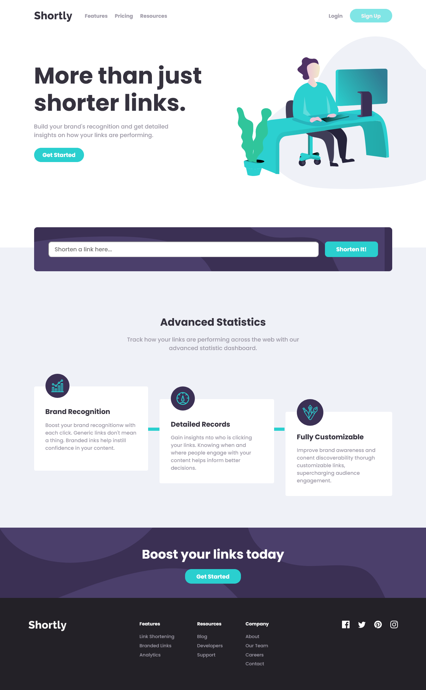

<!-- omit in toc -->
# Frontend Mentor - Shortly URL shortening API Challenge solution

This is a solution to the [Shortly URL shortening API Challenge challenge on Frontend Mentor](https://www.frontendmentor.io/challenges/url-shortening-api-landing-page-2ce3ob-G). Frontend Mentor challenges help you improve your coding skills by building realistic projects. 
<!-- omit in toc -->

 

## Table of contents

- [Table of contents](#table-of-contents)
- [Overview](#overview)
  - [The challenge](#the-challenge)
  - [Screenshot](#screenshot)
  - [Links](#links)
- [My process](#my-process)
  - [Built with](#built-with)
  - [What I learned](#what-i-learned)
  - [Useful resources](#useful-resources)
- [Author](#author)

 

## Overview

### The challenge

Users should be able to:

- View the optimal layout for the site depending on their device's screen size
- Shorten any valid URL
- See a list of their shortened links, even after refreshing the browser
- Copy the shortened link to their clipboard in a single click
- Receive an error message when the `form` is submitted if:
  - The `input` field is empty

### Screenshot

### Links

- Solution URL: [Solution](https://www.frontendmentor.io/solutions/url-shortening-api-landing-page-using-svelte-xsXP1Bts_T)
- Live Site URL: [Live site URL](https://url-shortening-app-three.vercel.app/)

 

## My process

### Built with

- Semantic HTML5 markup
- CSS custom properties
- Flexbox
- [Svelte](https://svelte.dev)
- [Gitpod](https://gitpod.io)

 

### What I learned
Instead of the typical web development with HTML, CSS, JavaScript, the web application was developed using Svelte. With Svelte, I break down parts of the web into Svelte Components. I chose Svelte instead of other frameworks because frameworks such as React and Vue feels different than the usual code style that I am used to without using frameworks. Svelte approach feels straightforward and it is pretty easy to learn.

 

### Useful resources

- [Svelte](https://www.svelte.dev/docs) - Web framework.
- [Gitpod](https://www.gitpod.io/docs) - Automated dev environment in the cloud.

 

## Author
- Frontend Mentor - [@sj0n](https://www.frontendmentor.io/profile/sj0n)